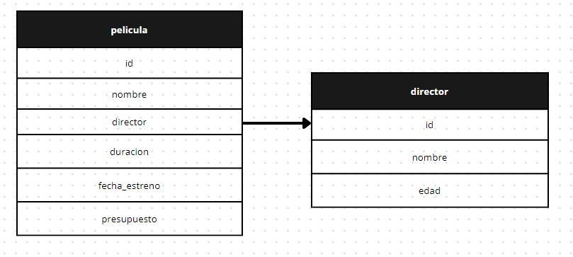

Peliculas y Directores.

En este proyecto pueden administrarse datos (informacion simple) que podrían llegar a usarse en paginas de peliculas y streaming online.

------------------------------ PELICULAS ------------------------------

Listar todas las peliculas:

 -- GET : peliculas

Se puede ordenar por cualquier campo (orderBy):

 -- GET : peliculas?orderBy={String}

Se puede especificar ademas si el orden (order) es ASCendente o DESCendente.

 -- GET : peliculas?orderBy={String}&order=ASC

 -- GET : peliculas?orderBy={String}&order=desc

Se puede filtrar por cualquier campo (filterBy), pero es preciso tambien recibir el valor (filter):

 -- GET : peliculas?director={int}

Listar una pelicula por su ID:

 -- GET : peliculas/:id

Agregar una pelicula:

 -- POST : peliculas

Campos requeridos para efectuar POST:
{
    "nombre" : varchar,
    "director" : number,
    "duracion" : number,
    "fecha_estreno" : date(Y-M-D),
    "presupuesto" : number
}

Modificar una pelicula:

 -- PUT : peliculas/:id

Campos requeridos para efectuar PUT:
{
    "nombre" : varchar,
    "director" : number,
    "duracion" : number,
    "fecha_estreno" : date(Y-M-D),
    "presupuesto" : number
}

Eliminar un pelicula:

 -- GET : peliculas/eliminar/:id

------------------------------ DIRECTORES ------------------------------

Listar todos los directores:

 -- GET : directores

Se puede ordenar por cualquier campo (orderBy):

 -- GET : directores?orderBy={String}

Se puede especificar ademas si el orden (order) es ASCendente o DESCendente.

 -- GET : directores?orderBy={String}&order=ASC

 -- GET : directores?orderBy={String}&order=DESC

Listar un director por su ID:

 -- GET : directores/:id

Agregar un director:

 -- POST : directores

Campos requeridos para efectuar POST:
{
    "nombre" : varchar,
    "edad" : number
}

Modificar un director:

 -- PUT : directores/:id

Campos requeridos para efectuar PUT:
{
    "nombre" : varchar,
   "edad" : number
}

Eliminar un director:
 -- GET : directores/eliminar/:id
